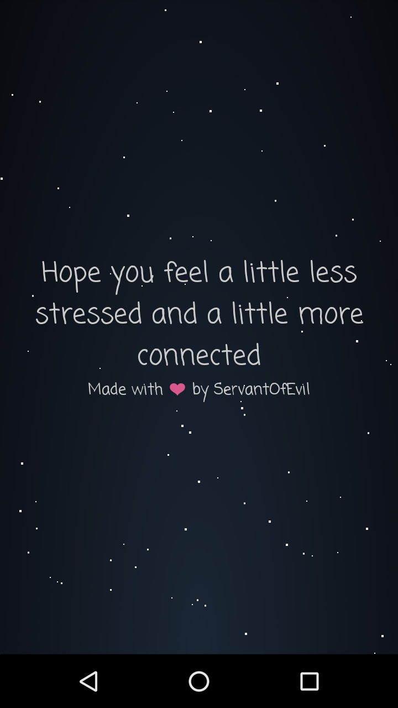

# PixelThoughts

PixelThoughts is a calming Android application designed to help users manage stress by transforming their overwhelming thoughts into a star. With soothing visuals and peaceful animations, it allows users to release their negative feelings and gain a fresh perspective.

<p align="center">
  
</p>

## About

PixelThoughts provides a simple yet effective way to relieve stress. When users feel overwhelmed, they can enter their thoughts into the app, which is visualized as a star. This star gradually fades into the vastness of space, symbolizing the release of negative thoughts. Accompanied by calming visuals, animations, and reassuring messages, PixelThoughts helps users relax and focus on the present moment.

## Key Features

- **Thought Visualization**: Turn your stressful thoughts into a moving star that gently fades away into space.
- **Calming Animations**: A serene, dynamic background with floating stars and smooth transitions to promote relaxation.
- **Reassuring Messages**: Encouraging messages are displayed to guide you through the process of letting go.
- **Relaxing Soundtrack**: Soft background music to deepen the sense of tranquility.
- **Full-Screen Mode**: A distraction-free immersive experience to help you fully relax and unwind.

## Technologies Used

PixelThoughts was built using the following technologies:

- **Android SDK** for app development.
- **Java** for the initial codebase.
- **Custom Views** for background and star animations.
- **Android `CountDownTimer`** for smooth transitions between states.
- **Android `MediaPlayer`** for playing calming background music.

## Getting Started

### Prerequisites

To get started with PixelThoughts, you will need:

- Android Studio installed on your machine.
- An Android device or emulator to run the app.

### Installation

Follow these steps to set up the project locally:

1. Clone the repository to your local machine.
   ```bash
   git clone https://github.com/vinhdq842/PixelThoughts.git
   ```

2. Open the project in **Android Studio**.
3. Build and run the project on your connected Android device or emulator.

## Contributing

If you'd like to contribute to PixelThoughts, feel free to follow these steps:

1. Fork the repository.
2. Create a branch for your feature or bugfix.
3. Make your changes and test them locally.
4. Open a pull request and describe your changes.

## Acknowledgments

PixelThoughts was inspired by the original version found at [pixelthoughts.co](https://www.pixelthoughts.co/). Special thanks to Marc Balaban for the concept and design.

---

**Created with ❤️ by [SOE](https://github.com/vinhdq842)**
